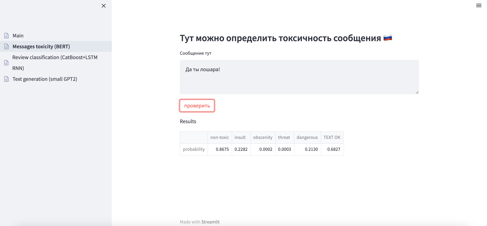
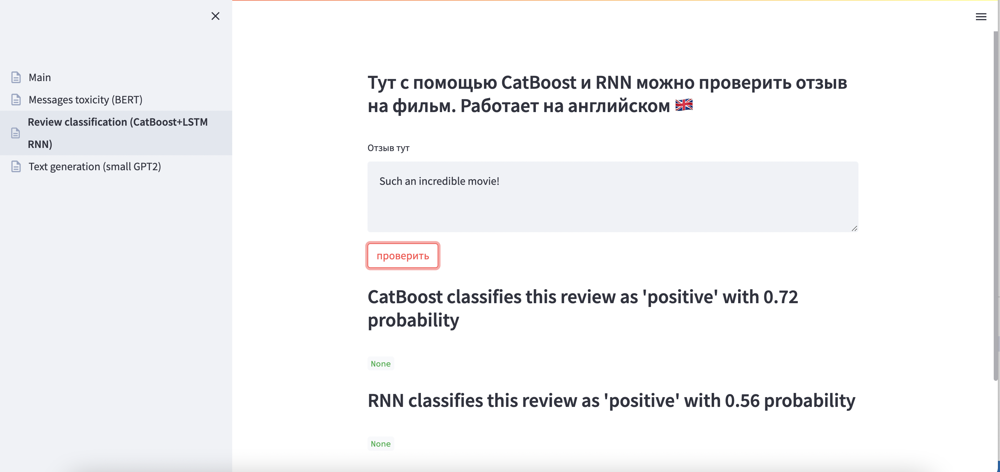
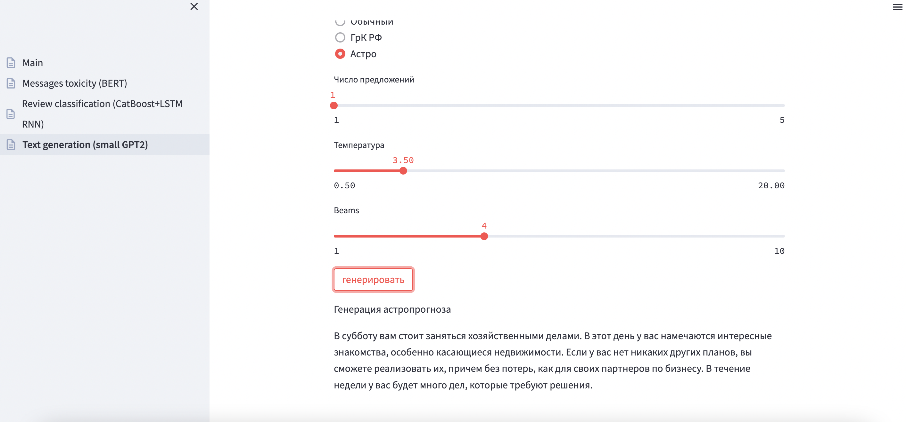

<h2> В приложении собраны несколько учебных NLP моделей: </h2>

- определение токсичности сообщения на основе [tiny RuBert](https://huggingface.co/cointegrated/rubert-tiny-toxicity).

 

- классификация озывов о фильмах, обученная на базе IMDB. Работает на Catboost и LSTM RNN

  

- генерация текста в стиле астропрогноза и гражданского кодекса РФ на основе [gpt](https://huggingface.co/sberbank-ai/rugpt3small_based_on_gpt2).

  

Для корректной работы модели необходимо скачать веса и положить в папку models: [астро](https://drive.google.com/drive/folders/1dFp7kFZIN_Cv9URqlKv_NMtmj1w5hXJJ?usp=sharing), [кодекс](https://drive.google.com/drive/folders/102CLwfE79ocz2bbupkCHMA8lpl54PrRs?usp=sharing)
